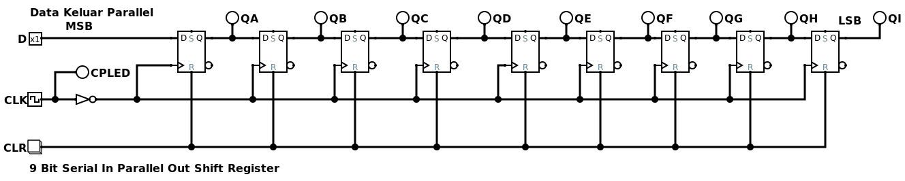

# Eksplorasi Rangkaian Digital: Shift Register 💾
Repositori ini berisi eksperimen dan implementasi nyata dari rangkaian digital shift register. 
Rangkaian ini fundamental dalam arsitektur sistem memori dan komunikasi digital, 
berfungsi untuk menyimpan dan menggeser bit data secara berurutan.

## 1.Rangkaian Shift Register (Serial In Pararel Out) SIPO

## Deskripsi
Rangkaian ini mengambil data secara serial (bit per bit) melalui satu jalur input dan menyimpannya di setiap flip-flop. 
Setelah semua bit masuk, data yang tersimpan bisa dikeluarkan secara bersamaan (paralel) melalui beberapa jalur output.

## Cara Kerja
Bayangkan ini seperti antrean: setiap orang (bit data) masuk satu per satu, tapi begitu semua sudah di dalam, 
mereka bisa keluar sekaligus dari pintu yang berbeda. Aplikasi utamanya adalah mengubah data serial 
menjadi data paralel, yang sering digunakan dalam decoder atau driver tampilan.

## 2. Rangkaian Shift Register (Pararel In Pararel Out) PIPO

## Deskripsi 
PIPO adalah jenis shift register yang paling sederhana. Rangkaian ini memungkinkan data untuk dimasukkan secara paralel (bersamaan) 
dan dikeluarkan juga secara paralel. Fungsi utamanya adalah sebagai penyimpanan sementara atau buffer untuk data.

## Cara Kerja 
Ini mirip seperti kotak penyimpanan dengan banyak laci: Anda bisa memasukkan semua barang (bit data) ke laci yang berbeda secara bersamaan, 
dan mengambilnya kembali juga secara bersamaan. Rangkaian PIPO digunakan untuk menyinkronkan data atau menyimpan data sementara sebelum diproses lebih lanjut.

## 3. Rangkaian Shift Register (Pararel In Serial Out) PISO

## Deskripsi
Rangkaian PISO mengambil data secara paralel melalui beberapa jalur input dan mengeluarkannya secara serial (satu per satu) melalui satu jalur output.

## Cara Kerja
Fungsinya berkebalikan dengan SIPO. PISO seperti antrean di mana semua orang (bit data) bisa masuk sekaligus, tapi harus keluar satu per satu melalui satu pintu. 
Rangkaian ini sangat berguna untuk mengirimkan data paralel jarak jauh menggunakan satu jalur transmisi tunggal, menghemat biaya dan kompleksitas kabel.

