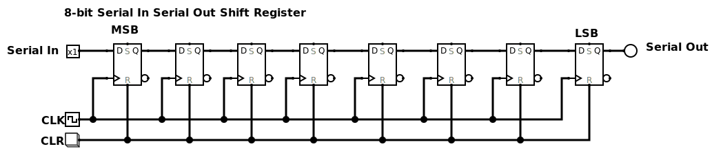
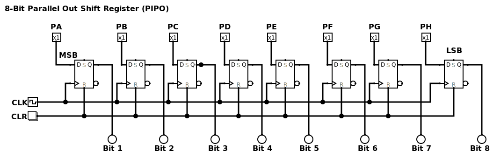

# Eksplorasi Rangkaian Digital: Shift Register 💾

Repositori ini berisi eksperimen dan implementasi nyata dari berbagai jenis rangkaian **shift register**.  
Shift register adalah salah satu rangkaian fundamental dalam arsitektur sistem digital, terutama pada **memori, komunikasi data, dan pengolahan sinyal**.  

Fungsi utamanya adalah untuk **menyimpan** dan **menggeser bit data** secara berurutan sesuai sinyal clock.  

---

## 📑 Daftar Isi
1. [Shift Register Serial-In Serial-Out (SISO)](#1-rangkaian-shift-register-serial-in-serial-out-siso)  
2. [Shift Register Serial-In Parallel-Out (SIPO)](#2-rangkaian-shift-register-serial-in-pararel-out-sipo)  
3. [Shift Register Parallel-In Parallel-Out (PIPO)](#3-rangkaian-shift-register-pararel-in-pararel-out-pipo)  
4. [Shift Register Parallel-In Serial-Out (PISO)](#4-rangkaian-shift-register-pararel-in-serial-out-piso)  
5. [Shift Register Bidirectional](#5-rangkaian-shift-register-bidrectional)  
6. [Shift Register Universal](#6-rangkaian-shift-register-universal)  
7. [Aplikasi Nyata](#aplikasi-nyata)  
8. [Lisensi](#lisensi)  

---

## 1. Rangkaian Shift Register (Serial-In Serial-Out) **SISO**

### Deskripsi
- Data masuk **bit per bit** secara serial.  
- Data keluar juga **bit per bit** secara serial.  
- Terdiri dari satu input dan satu output.  
- Bisa digeser ke kanan (*shift right*) atau ke kiri (*shift left*).  

### Cara Kerja
Bayangkan sebuah lorong sempit hanya dengan **satu pintu masuk dan satu pintu keluar**.  
Setiap orang (bit data) masuk berurutan, lalu keluar berurutan juga.  

---

## 2. Rangkaian Shift Register (Serial-In Parallel-Out) **SIPO**

### Deskripsi
- Data masuk secara serial, satu jalur input.  
- Setelah semua bit masuk, hasilnya bisa dibaca sekaligus melalui beberapa jalur output paralel.  

### Cara Kerja
Seperti antrean: orang (bit data) masuk satu per satu. Setelah semua sudah di dalam, mereka bisa keluar bersamaan lewat pintu berbeda.  

**Aplikasi:** Mengubah data serial menjadi paralel, sering digunakan pada **decoder, driver LED display, atau komunikasi UART ke perangkat paralel**.  

---

## 3. Rangkaian Shift Register (Parallel-In Parallel-Out) **PIPO**

### Deskripsi
- Data dimasukkan sekaligus (paralel).  
- Data dikeluarkan juga sekaligus (paralel).  
- Fungsi utamanya adalah **penyimpanan sementara (buffer)**.  

### Cara Kerja
Seperti **kotak dengan banyak laci**: semua barang (bit) bisa dimasukkan bersamaan, dan bisa diambil bersamaan juga.  

**Aplikasi:** Sinkronisasi data, buffer sementara sebelum diproses.  

---

## 4. Rangkaian Shift Register (Parallel-In Serial-Out) **PISO**

### Deskripsi
- Data masuk paralel (semua bit sekaligus).  
- Data keluar serial (bit per bit).  

### Cara Kerja
Kebalikan dari SIPO. Semua orang (bit data) bisa masuk bersamaan, tapi keluar satu per satu lewat pintu tunggal.  

**Aplikasi:** Efisiensi transmisi data, misalnya mengirim data paralel lewat **satu jalur komunikasi tunggal**.  

---

## 5. Rangkaian Shift Register **Bidirectional**

### Deskripsi
- Data bisa digeser ke **kanan atau kiri** sesuai kontrol.  
- Fleksibel dalam pergeseran bit.  

**Aplikasi:** Operasi aritmatika (perkalian/pembagian dengan basis 2), buffer data dua arah.  

---

## 6. Rangkaian Shift Register **Universal**

### Deskripsi
- Shift register paling fleksibel.  
- Mendukung semua mode: **SISO, SIPO, PISO, PIPO, serta shift kiri/kanan**.  
- Terdapat input kontrol tambahan untuk memilih mode.  

**Aplikasi:** Digunakan dalam sistem kompleks seperti **CPU, register umum, hingga pengendali komunikasi**.  

---

## 📌 Aplikasi Nyata
Shift register banyak dipakai dalam:
- **Komunikasi data:** UART, SPI, I²C.  
- **Driver tampilan:** 74HC595 untuk mengendalikan LED matrix atau 7-segmen.  
- **Memori sementara:** buffer data, register di prosesor.  
- **Sistem kontrol:** konversi data serial ↔ paralel.  

---

## 📖 Referensi
- Floyd, T. L. *Digital Fundamentals*.  
- Datasheet IC 74HC595, 74HC194.  
- Modul Praktikum Sistem Digital.  

---

## 📝 Lisensi
Proyek ini dirilis dengan lisensi **MIT**.  
Silakan digunakan, dimodifikasi, dan dikembangkan lebih lanjut untuk tujuan pembelajaran.  

---

